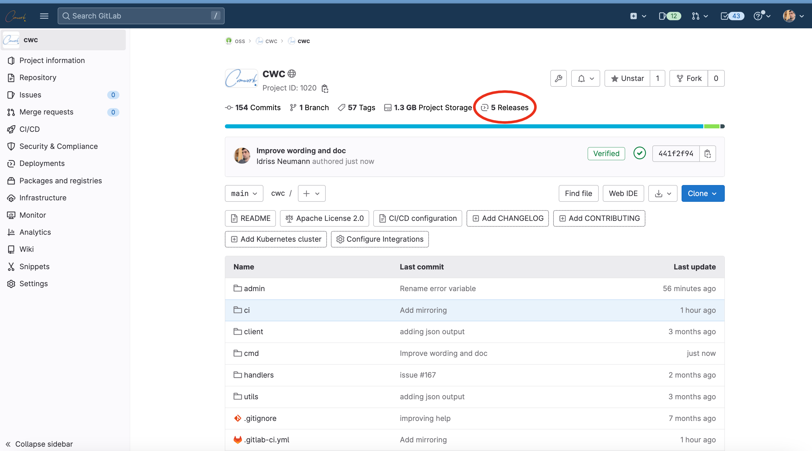
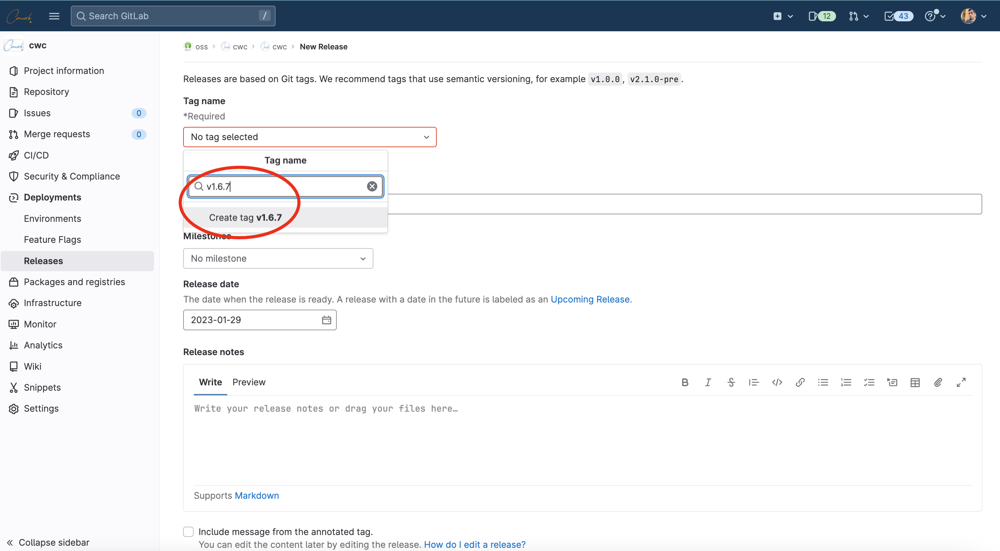
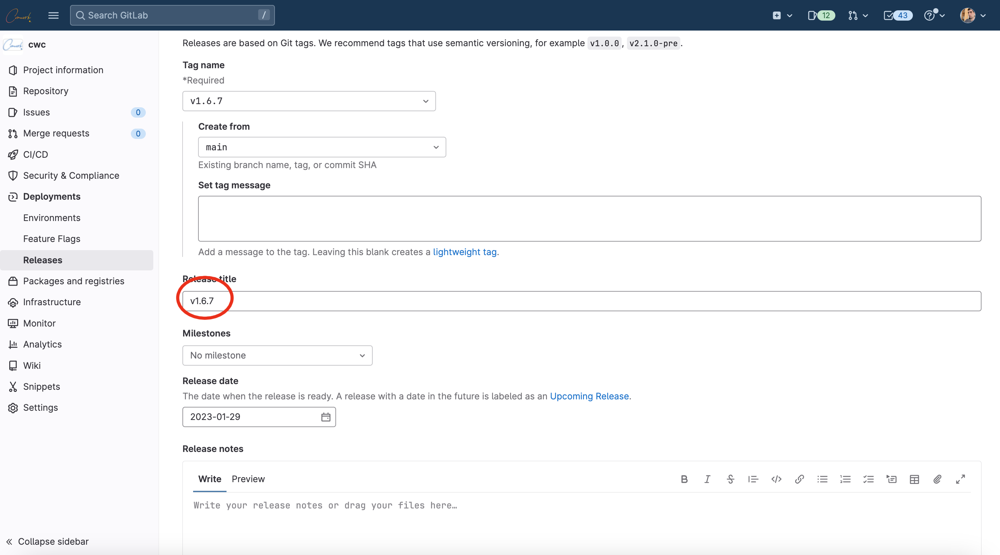
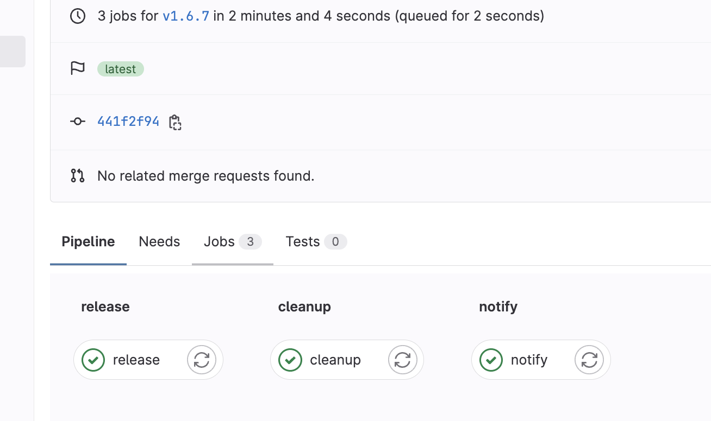

# Contribution Guidelines
👋 Welcome to cwc CLI! We're thrilled that you're interested in contributing to our open-source project.

## Development
### Prerequisites
- [golang](https://go.dev/doc/install)
### Run the project
```shell
go run main.go
```
This will run the main file.  
Like the normal use of the CLI you can follow the previous command with flags and subcommands.

## Deliver a new release

__1/__ Create a new release







__2/__ A pipeline will be triggered



It'll build the CLI for Linux, MacOS X and Window platform for x86 and aarch64 architectures and upload the artifacts in gitlab:


The the brew formula will be updated [here](https://gitlab.comwork.io/oss/cwc/homebrew-cwc). You'll just have to perform those commands to update the CLI in your device:

```shell
brew update
brew upgrade cwc
```