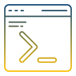

# CWCloud CLI

👋 Welcome to cwc CLI!

      

This is a CLI written in go that will help you work with [CWCloud API](./README.md).  
It's pretty easy to ship into your IaC pipelines.

You'll find everything you need in [our documentation](https://www.cwcloud.tech/docs/tutorials/cli).

## Installation

Go check [this documentation](https://www.cwcloud.tech/docs/tutorials/cli/install) for installation instructions.

## Where you can find this repository ?

* Main repo: https://gitlab.cwcloud.tech/oss/cwcloud/cwc.git
* Github mirror: https://github.com/comworkio/cwc.git
* Gitlab mirror: https://gitlab.com/ineumann/cwc.git

## Contributions

If you're interested in contributing to our project please check out [contributing section](./CONTRIBUTING.md).
